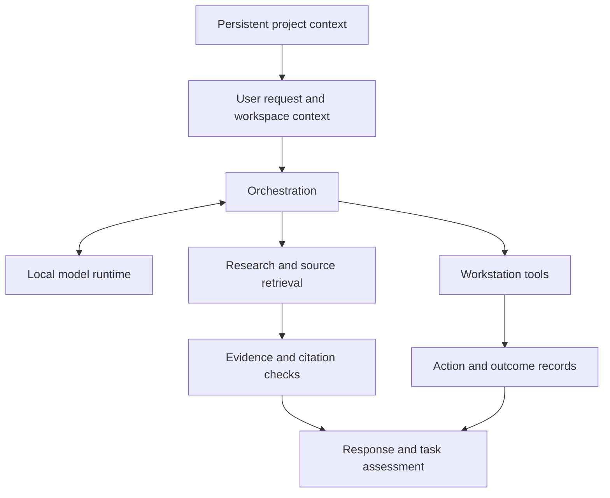

# Project Theo

**Private personal system · Public engineering case study · No public release planned**

Designed and built by Christopher M., the developer behind BrutalFoundry.

Theo is a private, locally controlled AI system for my Windows workstation. Its goal is a general-purpose assistant combining robust research and multi-channel search, reasoning and problem-solving, writing and analysis, persistent project memory, computer assistance, and the assessment, repair, extension, and building of applications. Application development is a core capability within that broader goal.

These are intended outcomes, not a claim that every workflow is already reliable. Local control includes internet-connected research; it does not mean an offline-only assistant.

This repository presents the engineering work and its current limits. Theo's source, personal memory, configuration, and operational data remain private.

## What I am building Theo for

A typical intended task is to investigate a question within an ongoing software project: find the relevant local files, consult documentation, preserve the sources behind the answer, and assess the next action in the context of that project. Research, writing, and application work share the same local foundation rather than starting from an empty conversation each time.

The case study follows the engineering needed to support that goal: keeping project context relevant, tracing evidence, controlling tool execution, and checking outcomes within the workstation's memory and GPU limits. The sections below distinguish demonstrated building blocks from workflows still being evaluated.

## The engineering problem

A useful workstation assistant needs more than a model that produces fluent answers. It needs to select relevant tools, preserve the user's intent, keep evidence attached to claims, work within hardware limits, and distinguish an attempted action from a completed task.

Theo brings these concerns together in a personal development environment where failures can be inspected and improvements evaluated against actual use.

## Architecture at a glance

Conceptual data flow. Research checks and action records provide different kinds of evidence; neither automatically proves that the user's whole objective was fulfilled.

## Selected engineering work

### Research with provenance

Theo's research pipeline routes questions across general discovery, documentation, and specialized sources. Retrieved material retains source links and attempt records so an answer can be checked against what was actually obtained.

The difficult part is source fit: a relevant-looking page may still fail to answer the precise question. Work on bounded routes includes preserving named-source requirements, inspecting rejected synthesis, validating final citations, and limiting fallback behavior. Configured providers and wrappers are not counted as independent search engines or proof of answer quality.

Useful narrow research paths have evidence behind them. Broad unfamiliar research and synthesis remain under acceptance work.

### Workspace context and memory

Theo distinguishes general workstation context from project-specific context. Persistent project files and saved records support continuity, exact-file questions, and recovery when a requested file is missing.

Persistence alone is not enough. Context must stay relevant to the current workspace, and old decisions need rechecking when the system changes. Long-term correction, conflicting memories, and complete task resumption remain workflow-level evaluation questions.

### Tool orchestration and recovery

The ordinary Theo route exposes scoped file reading/search, internet research, browser navigation/snapshots, and shell execution. The surrounding integration has other native capabilities, but their presence does not prove equal availability through Theo's ordinary route.

Bounded planning, action records, persistent approval checkpoints, and verification components provide useful building blocks. Recent remediation adds a shared command-authority boundary, binds approvals to the planned action and workspace, protects narrow new-file creation from overwriting an existing target, and avoids duplicate execution of verification programs.

Selected offline checks and disposable real-adapter tests support those changes, including an approved overwrite, resume, independent readback, and rollback on temporary files. Controlled fixtures establish contract behavior; they do not establish model intelligence or production UI reliability. Recovery must preserve the original objective rather than treat a fallback answer as automatic success.

### Hardware-aware local inference

Theo uses local model runtimes with explicit model selection, dedicated-GPU routing, lazy loading, a 60-second idle release, and rollback options. Evaluation considers context capacity, quantization, GPU placement, RAM pressure, latency, and desktop responsiveness together.

Work includes experiments across a heterogeneous two-GPU workstation. These experiments do not establish that every candidate is usable or that the deployed primary model uses both GPUs. A candidate can pass a small native screen and still fail under the real adapter's memory demands. Larger models and fuller VRAM allocation are not accepted as improvements without better useful behavior.

### Deployment and verification

Windows integration introduces a second identity problem: project source and the installed adapter can differ. Theo's records distinguish source checks, disposable adapter tests, saved live captures, and current production behavior.

Recovery work preserves the locally patched integration as a versioned overlay against a pinned upstream package. Isolated reconstruction verified the complete package file inventory, and a combined recovered Theo/integration test passed an approval, resume, readback, and rollback sequence using existing dependencies.

This establishes a bounded source/package recovery path. Fresh-machine dependency installation and frontend source rebuilding remain unproven. A successful source edit or recovered import does not establish that the running UI behaves correctly.

## Current assessment

Theo has useful bounded capabilities and retained test evidence, but it is not broadly certified as an everyday autonomous assistant.

The architecture audit identified command-approval bypasses, a deployment recovery gap, and unfinished general-research acceptance. Subsequent remediation addresses the original command-dispatch defect in selected offline and disposable checks and adds tested package reconstruction.

The latest inspected production UI attempt paused for approval and left the target unchanged, but the planned working directory differed from the requested directory and the generated approval explanation. Its planned verification also did not prove exact file content. The attempt was not an end-to-end pass. Repairs to directory handling, approval presentation, and exact-content verification are ongoing.

Broad unfamiliar research, complete paper workflows, generalized interactive browser work, durable memory correction/resume, and end-to-end application development still need representative current-model evidence. Broader autonomy remains subject to the relevant authority, recovery, and workflow proofs.

This case study describes the issues at the level of engineering responsibilities. It does not publish bypass recipes, internal prompts, private configuration, personal records, or exact runtime topology.

## What this project demonstrates

Theo brings together local inference, research provenance, persistent context, Windows integration, resource-constrained evaluation, and evidence-based debugging. Its value as a case study includes the corrective work: identifying where passing tests leave gaps, narrowing claims to observed behavior, and choosing reliability work over adding another feature.

Theo remains a personal system under development. There is no public product release planned.
